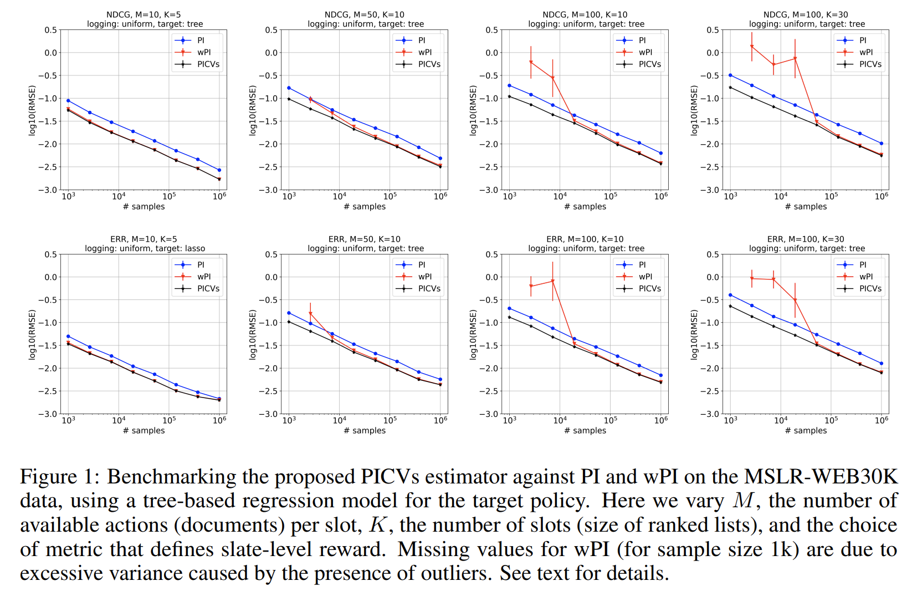

# Control Variates for Slate Off-Policy Evaluation

This repository is the official implementation of _N. Vlassis, A. Chandrashekar, F. Amat and N. Kallus. ["Control Variates for Slate Off-Policy Evaluation"](https://arxiv.org/abs/2106.07914), in NeurIPS, 2021_. 

## Requirements

To install requirements:

```setup
pip install -r requirements.txt
```

### How to download the Microsoft WEB MSLR 30K dataset
In order to run these experiments you need to download the [Microsoft Learning to Rank Datasets](https://www.microsoft.com/en-us/research/project/mslr/) and follow these steps:
1. Download the dataset [here](https://1drv.ms/u/s!AtsMfWUz5l8nbXGPBlwD1rnFdBY). It is a ~3.7GB Zip file
2. You will need to sign in with a One Drive account to download the file.
3. Inside the file there are five folders named `Fold%d`. Just use files in subfolder `Fold1`. Extract the three `txt` files in subfolder `Fold1`
4. Combine the three txt files extracted with the following Unix command `cat test.txt train.txt vali.txt > mslr.txt`
5. Copy the file `mslr.txt` (~4.1GB) to the relative folder `./slateOPE/MSLR_WEB30K/Datasets/mslr/mslr.txt`

**Note:** if you want to check that the code runs, you can probably "downsample" the `mslr.txt` file. Once you have verified the code runs in your machine, you can rerun with the entire dataset. You should have at least 64GB to run the code with all the data.


## Evaluation

### Section 6: Experiments on real data
In order to reproduce the data points in Section 6 Figures 1 and 2 of the paper go to `MSLR_WEB30K` folder and run the `main.py` script.

For example, `python3 main.py -m 20 -k 5 -r NDCG -n 5000 -s 300` runs a simulation for all estimators for 5 slots with top-M=20 predicted documents and NDCG metric. Each simulation is run 300 times with 5000 samples each.  


### Section 7: Experiments on synthetic data
In order to reproduce any of the data points in Section 7 Figure 3 of the paper, go to `simulator` folder and run the `main.py` script.

For example, `python3 main.py -k 2 -d 10 -n 600 -s 6000` runs the simulation for all estimators for a slate of 2 slots with 10 actions per slot. Each simulation is run 6000 (=20x300) times with 600 samples each. This is actually the first point (upper left corner) displayed in Figure 2.   

**Note:** This part of the code uses [Joblib package](https://joblib.readthedocs.io/en/latest/) to parallelize simulation and reduce computational time.


## Results

Our model achieves the following performance on MSLR-WEB30K:


